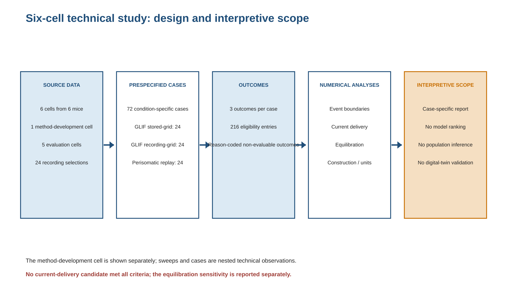
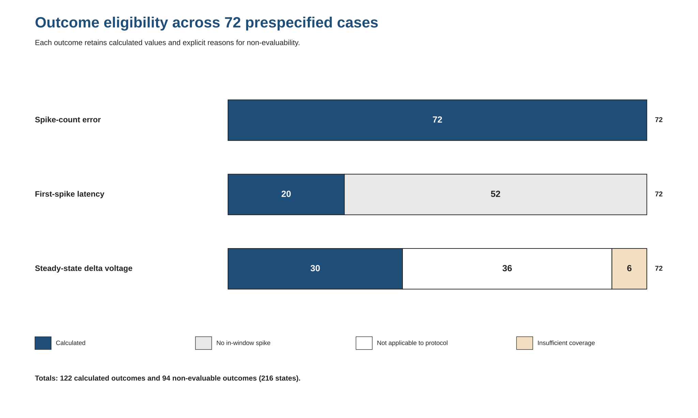
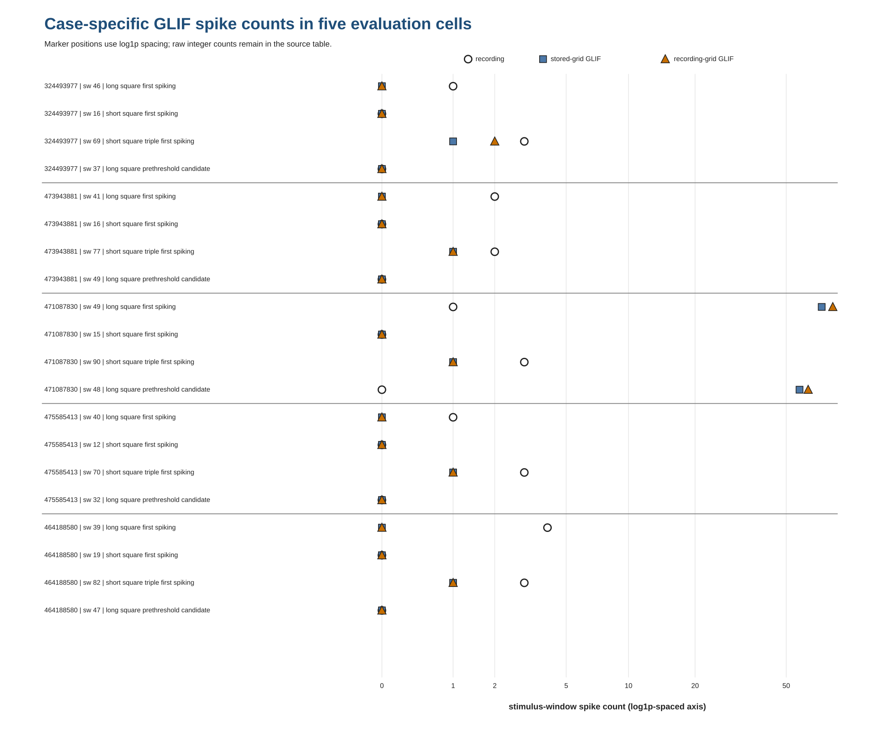
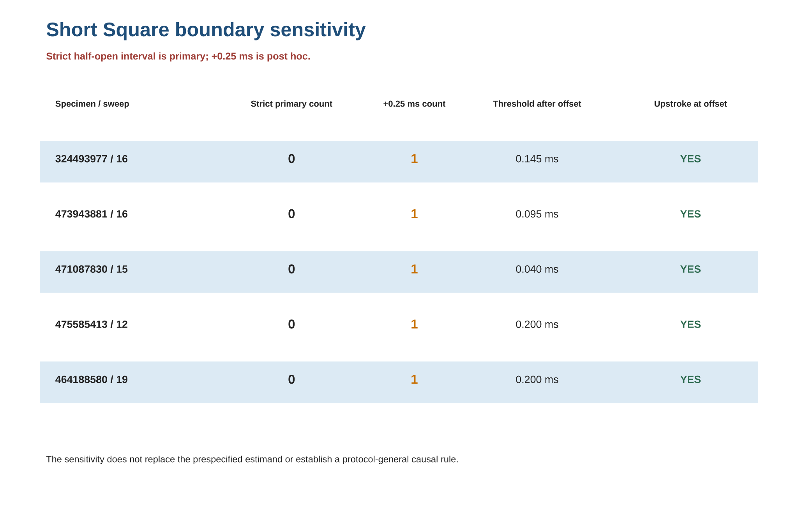
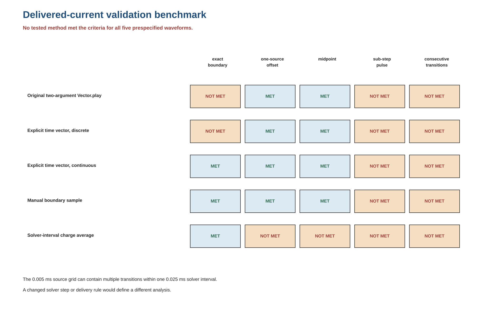
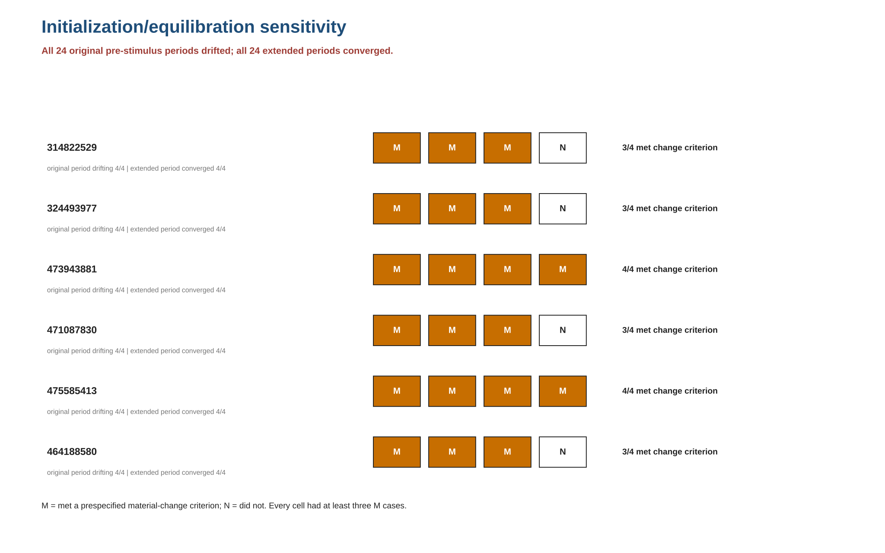

# Benchmarking stimulus delivery and equilibration in cell-matched neuronal model replay

**Running title:** Stimulus-delivery and equilibration benchmarks

## Abstract

Deterministic reruns of neuronal simulations can reproduce archived outputs while still misrepresenting
the commanded stimulus or beginning from a drifting model state. We evaluated these risks in six Allen
Cell Types specimens from six mice: one method-development specimen and five prespecified evaluation
specimens. Twenty-four protocol-specific recording selections produced 72 analysis cases under two
generalized leaky integrate-and-fire (GLIF) conditions and one perisomatic condition. Three outcomes
produced 216 eligibility records: 122 calculated values and 94 reason-coded non-evaluable outcomes.
Model-construction verification mapped all 158 fit selectors to their intended constructed-section
classes, and recording metadata established file-specific SI units for all six NWB files. We then
evaluated five current-playback methods using five synthetic benchmark waveforms at the original
0.025 ms solver step. None met all transition, pulse-width, amplitude, and charge criteria, so no
candidate was applied to the 24 perisomatic cases. Separately, all 24 original pre-stimulus periods
showed drift under at least one prespecified criterion; all extended-equilibration runs converged at
3.0 s, and 20 of 24 cases met at least one material-change criterion across all six specimens. These
results show that verified input files and deterministic execution do not establish stimulus-delivery
fidelity or initialization-insensitive behavior. In a separately labeled post hoc reference
implementation, fixed-step boundary sampling at 0.005 and 0.0025 ms and event-timed piecewise-constant
delivery met all five waveform criteria. The study provides benchmark waveforms,
equilibration diagnostics, outcome-eligibility rules, and machine-readable reports for case-level
validation; the six-cell design does not support population inference, model-class ranking, or
broad biological validation.

**Keywords:** cellular electrophysiology; computational neuroscience; GLIF; NEURON; stimulus
delivery; equilibration; reproducibility

## Introduction

Deterministic reruns are often treated as evidence that a neuronal simulation was reproduced
correctly. They establish repeatability of a particular implementation, but not necessarily numerical
fidelity to the intended experiment. A high-rate current command can contain several transitions
within one solver interval; sampling that command only at solver boundaries can alter transition
times, pulse widths, amplitudes, or delivered charge even when every input file is correct and every
rerun is byte-identical.

Initialization creates a separate numerical risk. Conductance-based models may retain voltage,
gating-state, or membrane-current drift after their nominal initialization step, and extending the
unstimulated period can change subsequent spikes or steady-state voltage. Input delivery and model-state
stability must therefore be tested independently. The NEURON environment exposes explicit choices for
fixed-step integration and time-vector playback [3,4], making it possible to benchmark stimulus
delivery and equilibration before physiological interpretation.

The Allen Cell Types resource makes cell-matched electrophysiology, morphologies, and model
resources available at specimen-level identifiers [5]. This enables specimen-level provenance,
but it does not eliminate the distinction between source identity, successful execution, and
scientific interpretation. The Neurodata Without Borders (NWB) format likewise supports
structured provenance and unit metadata, while legacy files may still require file-specific
interpretation [6].

Reproducible computational neuroscience also depends on transparent implementations, versioned
software, model descriptions, and executable archives [10–12]. Cross-simulator work has
shown that nominally equivalent neuronal models may converge only at sufficiently fine spatial and
temporal discretization [11]. This observation motivates direct numerical tests of the command
waveform and initialized state rather than relying on model-file identity alone.

Here we present a validation workflow comprising source and model provenance,
model-construction verification, stimulus-delivery benchmarks, initialization and equilibration
diagnostics, deterministic rerun checks, and explicit outcome eligibility. We applied it to one
method-development specimen and five evaluation specimens, 24 prespecified recording selections,
three simulation conditions, and three outcomes. The objective was to determine what the case-level
results support once numerical fidelity and model-state stability are evaluated directly.

## Results

### A prespecified six-cell design produced 72 condition-specific cases

The cohort comprised six mouse visual-cortex cells, each mapped through the official Allen API to
a distinct donor (Table 1). The method-development cell, specimen 314822529, was an Rorb-line layer-5
VISp cell. The five evaluation cells included one Sst-line and one Pvalb-line cell and three
Htr3a-line cells across VISp layers 1, 2/3, and 6a. These source descriptors document composition;
the small, unbalanced operational cohort does not support cell-type, layer, sex, or population
comparisons.

The method-development specimen contributed four previously characterized raw-label selections and
remained analytically separate. Each evaluation specimen contributed Long Square first-spiking,
Short Square first-spiking, Short Square triple first-spiking, and Long Square
prethreshold-candidate selections. The 24 selections were each
represented under GLIF stored-grid, GLIF recording-grid, and perisomatic recording-grid playback,
yielding 72 cases (Figure 1). Exposure of these exact sweeps during model fitting or evaluation
could not be established, so no result is described as held-out or out-of-sample.

**Table 1. Cohort, source animals, and analytical strata.** Ages are postnatal days. Detailed
specimen, model, recording, and role metadata are provided in Supplementary Table S1.

| Specimen | Stratum | Donor | Sex | Age | Genotype | Hemisphere | Source structure |
|---:|---|---:|---|---|---|---|---|
| 314822529 | method development | 313403626 | male | P53 | Rorb-IRES2-Cre/wt; Ai14(RCL-tdT)/wt | left | VISp5 |
| 324493977 | evaluation | 322489543 | male | P54 | Sst-IRES-Cre/wt; Ai14(RCL-tdT)/wt | right | VISp2/3 |
| 473943881 | evaluation | 472963252 | female | P63 | Htr3a-Cre_NO152/wt; Ai14(RCL-tdT)/wt | left | VISp2/3 |
| 471087830 | evaluation | 469953343 | male | P55 | Pvalb-IRES-Cre/wt; Ai14(RCL-tdT)/wt | left | VISp6a |
| 475585413 | evaluation | 475544273 | male | P59 | Htr3a-Cre_NO152/wt; Ai14(RCL-tdT)/wt | right | VISp1 |
| 464188580 | evaluation | 418778036 | female | P59 | Htr3a-Cre_NO152/wt; Ai14(RCL-tdT)/wt | left | VISp2/3 |

**Figure 1. Study design and interpretive scope.** Source records, prespecified cases, outcomes,
numerical evaluations, and interpretive limits are shown in sequence. The method-development cell remained
separate, and neither cases nor sweeps were treated as biological replicates.

### Outcome eligibility was retained instead of converted to failure scores

Exactly three outcomes were prespecified: absolute stimulus-window spike-count error, conditional
absolute first-spike-latency error, and Long Square absolute steady-state delta-voltage error. The
spike-count outcome was calculated in all 72 cases. Latency was calculated only when both the
recording and model contained a retained in-window spike, producing 20 calculated values and 52
spike-absence non-evaluable outcomes. Steady-state delta voltage required an eligible long-duration
protocol—`Long Square`, plus the method-development `Square - 2s Suprathreshold` label—and at
least 0.80 usable coverage in each relevant recording and model window; 30 values were calculated,
while 36 short-stimulus and six coverage-induced cases remained null (Table 2; Figure 2). Across all three
outcomes, 122/216 entries were calculated and 94/216 were reason-coded as non-evaluable. No unavailable value was replaced by
zero, a penalty, or a performance rank.

**Table 2. Prespecified metric applicability.**

| Metric | Calculated | Non-evaluable | Total |
|---|---:|---:|---:|
| Absolute spike-count error | 72 | 0 | 72 |
| Conditional absolute first-spike-latency error | 20 | 52 | 72 |
| Long Square absolute steady-state delta-voltage error | 30 | 42 | 72 |
| **All metric states** | **122** | **94** | **216** |

**Figure 2. Outcome eligibility across 72 prespecified cases.** Stacked bars distinguish calculated
values from non-evaluable outcomes caused by spike absence, protocol inapplicability, or
insufficient coverage. Numbers inside the bars are case counts. The complete case-by-outcome
matrix is Supplementary Figure S1 and Supplementary Table S3.

### Case-specific GLIF outputs varied by cell and protocol; no condition was preferred

The two GLIF conditions differed jointly in input grid and model step: 20 kHz stored-grid
execution used `dt = 50 µs`, whereas 200 kHz recording-grid execution used `dt = 5 µs`. They were
therefore retained as separate technical conditions. Their contrast is a coupled input-grid
and model-dt sensitivity.

Figure 3 displays raw stimulus-window spike counts for all 20 evaluation roles. For the five strict
Short Square first-spiking roles, the recording and both GLIF conditions each contained zero
in-window spikes. In four Long Square first-spiking roles, both GLIF conditions contained zero
spikes when the corresponding recordings contained 1, 2, 1, and 4 spikes for specimens 324493977,
473943881, 475585413, and 464188580, respectively. Specimen 471087830 behaved differently: its
Long Square first-spiking recording contained one spike, while the stored- and recording-grid GLIF
conditions contained 71 and 79; its prethreshold recording contained zero, while the corresponding
model conditions contained 57 and 62. Those two roles also failed the steady-state model-coverage
criterion, so their delta-voltage outcomes remained non-evaluable rather than being forced into
the steady-state comparison.

For the Short Square triple roles, recorded counts were two or three. Stored-grid GLIF returned one
spike in all five cells; recording-grid GLIF returned two for specimen 324493977 and one for the
other four. In the other four Long Square prethreshold roles, recordings and both GLIF conditions
contained zero spikes. Calculated Long Square GLIF steady-state errors for those supported rows
ranged from 1.198 to 4.556 mV, while evaluation-cell conditional latency values ranged from 1.258 to
14.119 ms. These are named-case observations, not a cross-cell estimate, equivalence test, or
model-condition ranking.

**Figure 3. Case-specific GLIF spike counts in the five evaluation specimens.** Recording, stored-grid GLIF,
and recording-grid GLIF counts are shown for each role. Horizontal placement uses log1p spacing so
both low counts and the high-count specimen 471087830 cases remain visible; exact integers are in
Supplementary Table S4. Marker shape and text, not color alone, identify the conditions.

### The strict Short Square window excluded five near-offset thresholds

For every evaluation Short Square first-spiking trace, the prespecified half-open command interval
`[onset, offset)` contained zero retained thresholds. A post hoc sensitivity
extended the right boundary by 0.25 ms without changing the detector. It contained one retained
threshold in each trace, occurring 0.040–0.200 ms after the prespecified offset. The filtered depolarizing
upstroke was already engaged at the offset in all five traces (Figure 4). The extension did not
replace the primary estimand, and no model metric was recalculated under it.

**Figure 4. Short Square boundary sensitivity.** Strict primary and post hoc sensitivity counts
are shown in prespecified specimen order. The result is specific to these five traces, the
prespecified event detector, and the stated boundary rule; it does not establish a protocol-general causal window.

### Model construction and file-specific recording units were verified

The six perisomatic constructions were tied to exact fit JSON, SWC morphology, compiled mechanism,
AllenSDK 2.16.2, and NEURON 8.2.7 identities. The construction analysis examined 158 fit rules.
Every selector mapped nonemptily and exclusively to the intended normalized constructed section
class; there were zero empty mappings, zero overinclusive mappings, and zero anomalies. The
section inventory used normalized `h.allsec()` names because named HOC SectionLists were empty,
while model assignments used direct selectors without fallback. The method-development cell had
apical sections and rules; the other five evaluation-cell constructions did not. These results establish
construction mapping identity, not morphology completeness, retention of disconnected source-SWC
components, fit optimality, equilibrium, or physiological validity.

The file-specific unit analysis established response in volts and stimulus in amperes for all six
NWB files. Five files used declared factor-1 conversion. The specimen 314822529 NWB was
a legacy IVSCC pipeline-1.0 exception: defective `0.001` response and `1e-12` stimulus conversion
attributes were bypassed under the AllenSDK pre-1.1 identity rule, with stored numerical
values treated as SI. Display transformations alone converted volts to millivolts and amperes to
picoamperes. The exception is file-specific and does not support a generic legacy conversion
rule.

### No original playback method satisfied all five synthetic benchmark waveforms

The delivered-current analysis tested the original two-argument `Vector.play` route and four alternatives against
five prespecified synthetic benchmark waveforms at fixed `dt = 0.025 ms` (Table 3; Figure 5). The
original route passed the one-source-sample-offset and midpoint benchmarks but failed the
exact-boundary, sub-step-pulse, and consecutive-transition benchmarks. Explicit continuous playback
and manual boundary sampling passed the first three benchmarks but failed sub-step pulses and
consecutive transitions. Interval charge averaging passed only the exact-boundary benchmark under
the joint transition, pulse, amplitude, and
charge criteria. No candidate passed all five; consequently, none was applied to the 24 perisomatic cases.

**Table 3. Delivered-current validation benchmark.** “Criterion met” and “criterion not met” refer
to the complete prespecified acceptance criteria for each synthetic waveform.

| Candidate | Exact boundary | One-source offset | Midpoint | Sub-step pulse | Consecutive transitions | All five |
|---|---|---|---|---|---|---|
| Original two-argument `Vector.play` | Not met | Met | Met | Not met | Not met | No |
| Explicit time vector, discrete | Not met | Met | Met | Not met | Not met | No |
| Explicit time vector, continuous | Met | Met | Met | Not met | Not met | No |
| Manual boundary sample | Met | Met | Met | Not met | Not met | No |
| Solver-interval charge average | Met | Not met | Not met | Not met | Not met | No |

**Figure 5. Delivered-current validation benchmark.** Text and fill jointly indicate whether each
method met the criteria for each waveform. A 0.005
ms source grid can contain multiple distinct transitions within one 0.025 ms solver interval. A
single boundary value cannot expose all transitions, while interval averaging changes boundary
amplitude. Changing the solver grid or the estimand would define a different analysis.

### Post hoc reference implementations provide constructive delivery targets

We added a data-independent, piecewise-constant reference implementation after completing the
original analysis. Fixed-step boundary sampling was evaluated at 0.025, 0.0125, 0.005, and 0.0025
ms using the unchanged waveform criteria. The two coarser steps met the complete criteria for three
of five waveforms. The 0.005 and 0.0025 ms steps met the complete criteria for all five. An
event-timed piecewise-constant reference also met all five criteria. These post hoc results establish
constructive numerical targets and show that the benchmark can distinguish adequate temporal
resolution from inadequate resolution. They do not establish compatibility with a particular
NEURON current-injection mechanism, and no amended perisomatic analysis was run.

### Perisomatic outputs met material-change criteria in all six cells

The initialization/equilibration analysis preserved the existing playback path so that sensitivity
could be isolated from a delivery-method change. It used 48 independent simulations: one unchanged
original-duration replay and one separately labeled extended-equilibration run for each of the 24 prespecified
perisomatic cases. All reference time and voltage arrays exactly reproduced the original outputs.
Nevertheless, every original pre-stimulus period failed at least one prespecified voltage, state, or
current stability criterion. Every sensitivity met the two-consecutive-window convergence rule at
3.0 s.

Twenty of 24 cases met at least one prespecified material-change rule (Table 4; Figure 6). All six
cells therefore had at least three affected recording selections.
Eleven reference cases contained stimulus-window spikes, whereas every sensitivity contained
zero. Across the 12 Long Square cases with a defined comparison, steady-state shifts ranged from
9.482 to 25.440 mV. The four cases that did not meet a material-change threshold were Short Square
zero/zero-spike cases; their original pre-stimulus periods were still drifting.

**Table 4. Initialization/equilibration findings by cell.** Each cell contributed four cases.

| Specimen | Original pre-stimulus periods with drift | Extended equilibration converged | Material-change criterion met | Summary across recording selections |
|---:|---:|---:|---:|---|
| 314822529 | 4/4 | 4/4 | 3/4 | Criterion met in 3/4 selections |
| 324493977 | 4/4 | 4/4 | 3/4 | Criterion met in 3/4 selections |
| 473943881 | 4/4 | 4/4 | 4/4 | Criterion met in 4/4 selections |
| 471087830 | 4/4 | 4/4 | 3/4 | Criterion met in 3/4 selections |
| 475585413 | 4/4 | 4/4 | 4/4 | Criterion met in 4/4 selections |
| 464188580 | 4/4 | 4/4 | 3/4 | Criterion met in 3/4 selections |

**Figure 6. Initialization/equilibration sensitivity by cell.** Each block is one of four roles.
“M” denotes a case meeting a prespecified material-change rule; “N” denotes a case that did not.
Every original pre-stimulus period showed drift and every 3.0 s extended-equilibration run converged.

Independent replay recalculated all 576 retained trajectory slope/span statistics. The maximum
absolute OLS-slope difference was `2.0328790734103208 × 10−20`, and the maximum span difference
was zero. This confirms the reported calculations. It does not make the sensitivity a replacement
primary analysis, demonstrate corrected physiology, or show that initialization alone explains
model/recording differences. The delivered-current limitation remains independent.

## Discussion

The results distinguish source identity, deterministic execution, and physiological
interpretability. The six source files and model constructions could be identified
precisely; prior outputs could be reproduced deterministically; and the analyses retained their
prespecified event definitions and outcome-eligibility states. Yet no original delivered-current
method satisfied all synthetic benchmark waveforms, and equilibration changed the unchanged
perisomatic implementation under at least one material-change criterion in all six cells. File
identity and repeatability were therefore insufficient to support a physiological interpretation of
the perisomatic results.

The delivered-current result is not merely a missing-methods problem. It exposes a numerical incompatibility
between a 0.005 ms source grid and a 0.025 ms fixed solver interval under the prespecified demand to
preserve transitions, pulse widths, boundary amplitudes, and charge. Boundary sampling discards
within-step structure; charge averaging preserves one quantity while altering others. The post hoc
reference implementation shows that 0.005 ms fixed-step boundary sampling and exact event-timed
piecewise-constant delivery can meet the same synthetic criteria. Translating either reference into
a verified NEURON adapter and rerunning the perisomatic cases remains separate from the original
analysis and cannot retroactively reinterpret it.

The equilibration result was limited to the tested conditions. The reference
replay was exact, so the observed drift was not introduced by a changed computational path. The 3.0 s sensitivity converged by the
prespecified rule and altered 20 cases, including spike outputs and Long Square steady state. This
demonstrates dependence on initialization/equilibration under the unchanged implementation. It does not
identify a biologically correct starting state, and because the same delivery path was retained,
it cannot resolve the independent current-delivery problem.

The Short Square analysis illustrates a related estimand issue. The strict half-open interval was
consistently applied and remained primary, but all five thresholds occurred just after its right
boundary while the upstroke was already underway. Reporting both the prespecified result and the post hoc
sensitivity is more informative than silently shifting the window or treating zero count error as
general waveform agreement.

The GLIF rows show why case-specific reporting was preferable to a leaderboard. Several cells had
similar stored- and recording-grid counts, but specimen 471087830 produced high-count Long Square
outputs under both conditions and coverage-induced steady-state nulls. The paired conditions
change both the command grid and the numerical step; their contrast is a coupled input-grid
and model-dt sensitivity. Without known fitting-sweep exposure, a powered sample, or a common
model-class estimand, a cross-cell average or preferred-condition claim would overstate the design.

The software and machine-readable reports provide explicit numerical checks alongside established
approaches to model sharing and interoperability [10–12]. Their purpose is narrower than a universal
simulator standard: they can accompany an executable neuronal model and reveal
whether stimulus timing, state preparation, and outcome eligibility support the intended analysis.

### Limitations

Six operationally selected cells are not representative of mouse cortex, and the
method-development specimen is not part of the five-specimen evaluation set. Exposure of individual
sweeps during model fitting remains unknown. The GLIF comparison jointly changes the input sampling
grid and model time step and therefore cannot isolate either factor. The stimulus-delivery and
initialization findings are specific to the tested implementations, versions, and criteria; the study
does not identify a biologically correct initial state. Third-party payloads are retrieved by identifier
rather than redistributed, and complete clean-machine reproduction of the full Allen-data workflow
has not yet been demonstrated. The constructive playback extension is a model-free reference
implementation; it has not been verified as a NEURON injection route or applied to the 24 perisomatic cases.

### Methodological contribution

The study provides a current-delivery benchmark, an equilibration assessment,
explicit reason-coded outcome-eligibility rules, and a software and provenance package that other
groups can apply before interpreting neuronal model replay. Together these components distinguish
repeatability from stimulus-delivery fidelity, model-state stability, and physiological interpretation
without requiring population-level claims from the six-cell application.

## Methods

### Source data, animals, and ethics

Electrophysiology recordings, specimen metadata, GLIF configurations, perisomatic fit parameters,
morphologies, and model identifiers were resolved from the Allen Cell Types resource [5]. Official
Allen API v2 specimen queries were executed on 21 July 2026 for the six exact specimen IDs and
recorded with query URLs and file digests. They established six distinct donors, ages P53–P63,
four male and two female mice, genotypes, hemispheres, source structures, ephys-result IDs, and
recording Well Known File (WKF) IDs. No new animals, tissue collection, or experimental procedures
were used in the present secondary computational analysis. The source experimental procedures were
reported as conducted under the Allen Institute Institutional Animal Care and Use Committee in the
source study [7].

### Analytical strata and prespecified roles

Specimen 314822529 was retained as a previously characterized method-development cell and was not treated as
a sixth evaluation unit. The five evaluation cells were specimens 324493977, 473943881, 471087830,
475585413, and 464188580. Cell and sweep selection used metadata before response analysis.
Selection chronology was fully reconstructable for the final acquisition group and only partially
reconstructable for earlier groups.

The method-development cell retained Long Square (sweep 44), Short Square (17), Short Square Triple (75), and Square
2 s Suprathreshold (66) raw-label roles. Evaluation roles/sweeps were: 324493977, 46/16/69/37;
473943881, 41/16/77/49; 471087830, 49/15/90/48; 475585413, 40/12/70/32; and 464188580,
39/19/82/47, ordered as Long Square first-spiking, Short Square first-spiking, Short Square triple
first-spiking, and Long Square prethreshold candidate. Cells were the analysis units; sweeps and
model conditions were nested technical observations. The sample size was operational and no power
calculation or inferential population model was used.

### Recording units and command representation

Each recording was linked to an exact WKF ID and file digest. Five NWBs exposed response in
volts and stimulus in amperes through factor-1 conversion. For exact recording WKF 491202285,
specimen 314822529, defective legacy conversion attributes were bypassed under the AllenSDK pre-1.1
compatibility branch. Stored numerical SI values were used. Display-only transformations were
`mV = V × 1,000` and `pA = A × 10^12`.

Recording-grid commands were represented at 200 kHz. Stored-grid GLIF commands used nonoverlapping
factor-10 arithmetic means and block-start times to produce 20 kHz inputs without amplitude scaling,
interpolation, or padding. Perisomatic source commands were converted from amperes to nanoamperes
by `stimulus_nA = stimulus_A × 10^9` before fixed-step playback. This conversion specifies the
source vector; it does not establish solver-time delivered-current fidelity.

### Model conditions and exact construction

The 24 recording selections were executed or represented in three separate simulation conditions.
GLIF stored-grid used
`dt = 50 µs` at 20 kHz; GLIF recording-grid used `dt = 5 µs` at 200 kHz. Stored GLIF model spike
times were taken from the prespecified AllenSDK-returned spike arrays rather than redetected from model
voltage. GLIF models followed the Allen generalized leaky integrate-and-fire framework [1].

Perisomatic construction used specimen-specific fit JSON, SWC morphology, and compiled mechanisms
through AllenSDK 2.16.2 with NEURON 8.2.7 [2–4]. The construction route included
AllenSDK’s soma-attached two-section axon replacement and HOC `%g` serialization of section-targeted
values. The construction analysis instantiated models only, did not call `finitialize`, dispatch a stimulus, or
advance simulation time, and verified every fit selector against normalized constructed-section
names.

The perisomatic reference execution used fixed `dt = 0.025 ms`, inactive CVode, the documented
two-argument `Vector.play` route, and `h.finitialize()` at `t = 0`. These settings define execution
provenance. The delivered-current and equilibration methods below separately tested delivery and
pre-stimulus behavior.

### Event detection, windows, and masking

Recorded spikes followed the prespecified AllenSDK 2.16.2-equivalent detector: full-trace
detection, a four-pole zero-phase Bessel low-pass filter at 10 kHz, positive derivative cutoff 20
V/s, minimum peak −30 mV, minimum threshold-to-peak height 2 mV, maximum threshold-to-peak interval
5 ms, threshold refinement at 0.05 of mean retained upstroke, and final-return tolerance of
threshold plus 1 mV. No fixed refractory period was imposed. Overlapping threshold/peak pairs were
merged under the prespecified negative-derivative rule.

Stimulus windows were half-open. Each recording or model threshold created a half-open mask
`[t − 1 ms, t + 5 ms)`. Recording and model intervals were unioned and independently projected to
each native grid by physical-time membership, without trace interpolation. Source-specific Long
Square baseline and steady-state windows were retained from the prespecified case definitions
rather than recomputed after inspecting the combined results.

### Outcomes and analysis

Absolute spike-count error was `|model count − recording count|` and applied to every case.
Conditional absolute first-spike-latency error was
`|model first spike − recording first spike| × 1,000 ms` only when both traces contained at least
one retained in-window event. Long-duration absolute steady-state delta-voltage error was the absolute
difference between model and recording baseline-referenced steady-state changes, expressed in mV.
It applied to `Long Square` and the method-development `Square - 2s Suprathreshold` label and
required at least 0.80 usable unmasked coverage independently in recording and model baseline
and steady-state windows. Unavailable metrics retained the exact null reason and missingness class.

Analysis was descriptive and case-level. No composite score, correlation, full-trace RMSE,
normalized score, arm-average, cross-cell mean, confidence interval, or hypothesis test was part of
the prespecified analysis. No ranking or selection was performed. All displayed rounding is
presentational; full-precision values remain in the machine-readable tables.

### Short Square boundary sensitivity

For each primary Short Square first-spiking trace, the detector was replayed over the full corrected
trajectory. Counts were evaluated under the strict `[command_onset, command_offset)` window and a
separately labeled `[command_onset, command_offset + 0.25 ms)` sensitivity. Threshold/peak timing,
command indices, voltage, and filtered derivative values at the prespecified offset were retained. The
strict window remained the primary estimand.

### Delivered-current validation benchmark

Five model-free synthetic benchmark waveforms tested exact-grid boundaries, a one-source-sample offset, a
midpoint transition, a sub-solver-step pulse, and consecutive transitions. Five candidate routes
were assessed: original two-argument vector playback; explicit time-vector discrete and
continuous playback; manual boundary sampling; and solver-interval charge averaging. Acceptance
jointly evaluated transition count, pulse structure, boundary amplitude, and interval-aware charge
against prespecified tolerances. Satisfying all waveform criteria was required before applying a candidate
method to the 24 perisomatic cases. The analysis used Python 3.11.15 and NEURON 8.2.7 in the
specified WSL environment.

### Post hoc constructive playback extensions

After completing the original five-method analysis, we implemented a model-free piecewise-constant
reference in Python. Fixed-step boundary sampling used solver steps of 0.025, 0.0125, 0.005, and
0.0025 ms. At each solver boundary, it selected the zero-order-held source value without
interpolation. A separate event-timed reference applied every source transition at its specified
time. Both extensions were evaluated using the original transition-count, transition-timing,
pulse-width, boundary-amplitude, and interval-charge criteria and tolerances. The benchmark reports
full criterion-level results in deterministic JSON. Run-specific timing and interpreter metadata
are omitted because they are not scientific outcomes and do not affect the model-free calculations.

### Initialization/equilibration sensitivity

For each of 24 prespecified perisomatic cases, one unchanged reference process and one sensitivity
process were executed. Reference runs had to reproduce the original time and voltage arrays exactly.
Pre-stimulus telemetry included prespecified voltage, gating-state, and available membrane/current
trajectories. Stability was assessed in final 100 ms windows using prespecified slope/span and
current/state criteria. Sensitivities advanced the unstimulated model until two consecutive windows
passed, with convergence capped by the protocol; all converged at 3.0 s.

Material change followed prespecified rules for stimulus-window spike count, event timing,
coverage, and steady-state voltage. Sensitivity outputs remained separate from reference rows.
An independent calculation reproduced 576 trajectory statistics and separately evaluated the
two-window rule. Only runs generated with the final recorder-binding and data-capture configuration
were analyzed.

### Reproducibility

The combined analysis reconciled six cells, 24 roles, 72 cases, and 216 outcome-applicability
entries. Repeating the delivered-current analysis in the specified scientific environment produced
byte-identical result files. Repeating the equilibration analysis reproduced all 24 reference
trajectories, all 24 convergence classifications, and all retained trajectory statistics. File
digests were used to verify source and result identity. Automated tests for the analysis code and
tabular consistency are provided with the public software.

### Software environment

The scientific environment used micromamba 2.8.1, Python 3.11.15, NEURON 8.2.7
(commit `34cf696c4`), AllenSDK 2.16.2, NumPy 1.23.5, GCC 14.3.0, Ubuntu 26.04 LTS, GLIBC 2.43, and
Linux kernel 6.18.33.1-microsoft-standard-WSL2.

## Data and code availability

Study code, derived tables, figures, and machine-readable provenance are available in the
public distribution under the MIT license. The accompanying
data identify specimens, recordings, models, fits, morphologies, mechanisms, and source URLs. Allen
NWB files, model data, and compiled third-party binaries are not redistributed;
they must be retrieved from their original sources using the identifiers provided. Complete
reproduction from a fresh public environment has not yet been demonstrated [8].

## References

1. Teeter C, Iyer R, Menon V, et al. Generalized leaky integrate-and-fire models classify multiple neuron types. *Nature Communications*. 2018;9:709. doi:10.1038/s41467-017-02717-4.
2. Gouwens NW, Berg J, Feng D, et al. Systematic generation of biophysically detailed models for diverse cortical neuron types. *Nature Communications*. 2018;9:710. doi:10.1038/s41467-017-02718-3.
3. Hines ML, Carnevale NT. The NEURON simulation environment. *Neural Computation*. 1997;9:1179–1209. doi:10.1162/neco.1997.9.6.1179.
4. Hines ML, Davison AP, Muller E. NEURON and Python. *Frontiers in Neuroinformatics*. 2009;3:1. doi:10.3389/neuro.11.001.2009.
5. Allen Institute for Brain Science. Allen Cell Types Database and Allen Brain Map API v2. https://celltypes.brain-map.org/ and https://api.brain-map.org/. Accessed 21 July 2026.
6. Teeters JL, Godfrey K, Young R, et al. Neurodata Without Borders: creating a common data format for neurophysiology. *Neuron*. 2015;88:629–634. doi:10.1016/j.neuron.2015.10.025.
7. Gouwens NW, Sorensen SA, Berg J, et al. Classification of electrophysiological and morphological neuron types in the mouse visual cortex. *Nature Neuroscience*. 2019;22:1182–1195. doi:10.1038/s41593-019-0417-0.
8. Wilkinson MD, Dumontier M, Aalbersberg IJ, et al. The FAIR Guiding Principles for scientific data management and stewardship. *Scientific Data*. 2016;3:160018. doi:10.1038/sdata.2016.18.
9. Percie du Sert N, Hurst V, Ahluwalia A, et al. The ARRIVE guidelines 2.0: updated guidelines for reporting animal research. *PLOS Biology*. 2020;18:e3000410. doi:10.1371/journal.pbio.3000410.
10. McDougal RA, Bulanova AS, Lytton WW. Reproducibility in computational neuroscience models and simulations. *IEEE Transactions on Biomedical Engineering*. 2016;63:2021–2035. doi:10.1109/TBME.2016.2539602.
11. Gleeson P, Crook S, Cannon RC, et al. NeuroML: a language for describing data driven models of neurons and networks with a high degree of biological detail. *PLOS Computational Biology*. 2010;6:e1000815. doi:10.1371/journal.pcbi.1000815.
12. McDougal RA, Morse TM, Carnevale T, et al. Twenty years of ModelDB and beyond: building essential modeling tools for the future of neuroscience. *Journal of Computational Neuroscience*. 2017;42:1–10. doi:10.1007/s10827-016-0623-7.
