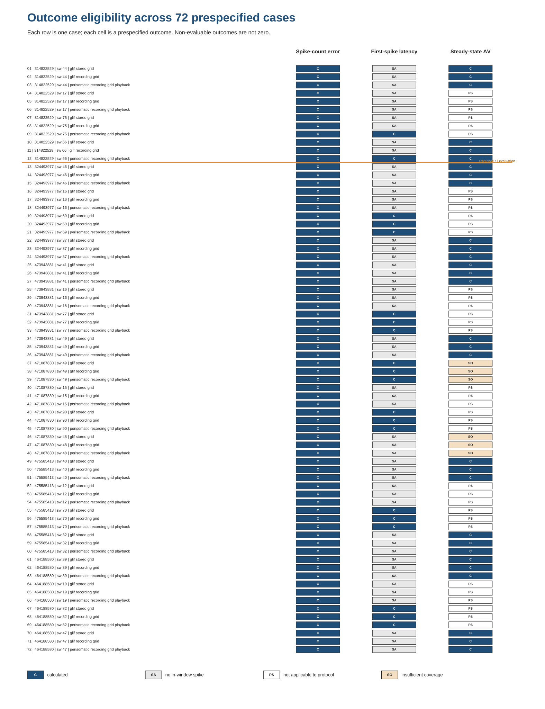

# Supplementary information

## Supplementary scope

This supplement accompanies “Benchmarking stimulus delivery and equilibration in cell-matched
neuronal model replay.” It provides prespecified recording-selection definitions,
case-level results, metric applicability, numerical sensitivity results, model-construction
mapping, and recording-unit verification. It does not introduce a pooled score, model ranking,
preferred numerical condition, or replacement perisomatic result.

## Supplementary Table S1: prespecified recording selections

Supplementary Table S1 lists all 24 recording selections. The first four rows describe the
method-development specimen, with the original stimulus labels retained. The remaining 20 rows
describe the four evaluation selections in each of five specimens. Whether any specific sweep was
used during model fitting or evaluation could not be established; no selection is therefore described as
held out or out of sample.

## Supplementary Table S2: complete 72-case results

Supplementary Table S2 contains the 72 condition-specific cases, with raw spike counts, the three
prespecified outcomes, applicability states, exact null reasons, usable coverage, and model
identity. Rows 1–12 correspond to the method-development specimen, and rows 13–72 correspond to
the five evaluation specimens. The ordering was prespecified and was not determined by outcome values.

The perisomatic rows reproduce the original implementation. Because no tested playback method
satisfied all delivered-current benchmark waveforms and 20 of 24 cases met at least one
material-change criterion in the equilibration sensitivity, these rows should not be interpreted as demonstrating physiologically faithful
current delivery or an initialization-insensitive state.

## Supplementary Table S3: complete 216-state metric applicability

Supplementary Table S3 contains three applicability entries for each of the 72 cases. Counts
reconcile as follows:

| Outcome | Calculated | Non-evaluable | Reason |
|---|---:|---:|---|
| Absolute spike-count error | 72 | 0 | unconditional |
| Conditional first-spike latency | 20 | 52 | one or both traces lacked a retained in-window spike |
| Long Square steady-state delta voltage | 30 | 42 | not applicable to 36 short protocols; insufficient model coverage in 6 cases |

The six coverage-related non-evaluable outcomes are the three model conditions for specimen 471087830, Long Square
sweeps 49 and 48. A missing numeric value together with its status and reason is the result; it is
not equivalent to zero or to a failed comparison.

**Supplementary Figure S1. Complete case-by-outcome eligibility matrix.** Each row is one of 72
prespecified cases and each column is one outcome. Codes distinguish calculated values from
non-evaluable outcomes caused by spike absence, protocol inapplicability, or insufficient
coverage. The first 12 rows correspond to the method-development specimen.

## Supplementary Table S4: evaluation-cell GLIF cases

Supplementary Table S4 contains all 40 GLIF cases from the five evaluation cells: 20 recording
selections under two numerical conditions. The stored-grid condition precedes the recording-grid
condition for presentation only. Input grid and numerical step change together, so the comparison
does not isolate either factor and does not imply a preferred condition.

## Supplementary Table S5: Short Square boundary sensitivity

Supplementary Table S5 provides the five complete event-boundary rows, including command indices,
threshold and peak times, filtered derivatives, voltage at the right boundary, strict counts,
post hoc counts, detector specification, and source-file identity. The prespecified half-open
interval remains the primary estimand.

## Supplementary Tables S6–S7: delivered-current validation benchmark

Supplementary Table S6 is the accessible 5 × 5 method-by-waveform matrix. Supplementary Table S7
provides transition, pulse, amplitude, charge, and edge-alignment results for all 25 combinations.
No original candidate method satisfied all five waveforms, and none was applied to the 24 perisomatic cases.

This finding does not establish a replacement delivery method. A changed solver step,
event-dispatch rule, or delivered-current estimand would define a new analysis and would require
evaluation against the same benchmark set.

## Supplementary Table S7A: post hoc constructive benchmark

Supplementary Table S7A reports the separately labeled, model-free constructive extension. Fixed
steps of 0.005 and 0.0025 ms and an event-timed piecewise-constant reference met the unchanged
criteria for all five waveforms. Fixed steps of 0.025 and 0.0125 ms met the complete criteria for
three of five waveforms. These results do not establish a verified NEURON current-injection route,
and no amended 24-case perisomatic analysis was run.

## Supplementary Tables S8–S9: initialization/equilibration sensitivity

Supplementary Table S8 summarizes the cell-level findings. Supplementary Table S9 contains the 24
case-level reference and sensitivity comparisons, including exact reproduction, pre-stimulus
stability, convergence time, spike counts, event shifts, steady-state shifts, and material-change
status.

All 24 original pre-stimulus periods showed drift; every extended-equilibration run converged at
3.0 s; and 20 cases met
at least one material-change criterion. Four Short Square cases remained zero/zero for
stimulus-window spikes and did not meet another material-change criterion, although their
original pre-stimulus periods were not stable. An independent calculation reproduced all 576 retained
trajectory statistics and the two-window convergence classifications.

## Supplementary Table S10: fit-section mapping

Supplementary Table S10 summarizes the six model constructions and all 158 section-targeting
rules.

| Specimen | Rules | Constructed sections | Constructed classes |
|---:|---:|---:|---|
| 314822529 | 28 | 79 | soma 1; axon 2; basal dendritic 37; apical 39 |
| 324493977 | 26 | 65 | soma 1; axon 2; basal dendritic 62 |
| 473943881 | 26 | 78 | soma 1; axon 2; basal dendritic 75 |
| 471087830 | 26 | 36 | soma 1; axon 2; basal dendritic 33 |
| 475585413 | 26 | 50 | soma 1; axon 2; basal dendritic 47 |
| 464188580 | 26 | 47 | soma 1; axon 2; basal dendritic 44 |

All 158 selectors mapped nonemptily and exclusively to the intended constructed-section class.
The section counts describe the instantiated computational models and are not biological
morphology comparisons.

## Supplementary Table S11: recording units

Supplementary Table S11 reports file-specific response and stimulus units. Five NWB files use
declared factor-1 conversion for response in volts and stimulus in amperes. Specimen 314822529,
recording WKF 491202285, is a file-specific legacy exception: defective metadata conversion
attributes are bypassed under the AllenSDK pre-1.1 identity rule, and stored numerical values are
treated as SI. Display equations are V × 1,000 for millivolts and A × 10^12 for picoamperes.

This verification establishes units for the six named recordings. It does not evaluate recording
quality, solver-time stimulus delivery, or biological validity.

## Supplementary Table S12: interpretive scope

| Analysis | Finding | Supported interpretation |
|---|---|---|
| Short Square boundary | Strict count 0/5 traces; post hoc +0.25 ms count 1/5 in every trace | Trace-specific primary result plus separately labeled boundary sensitivity |
| Delivered current | No original candidate satisfied all five benchmark waveforms | Numerical limitation of the tested playback routes; no claim of intended solver-time delivery |
| Initialization/equilibration | All original pre-stimulus periods showed drift; all extended-equilibration runs converged; 20/24 cases met a material-change criterion | Dependence on initialization/equilibration under the unchanged implementation |
| Fit-section mapping | All 158 selectors mapped to the intended constructed-section class | Exact construction-route identity only |
| Recording units | SI response and stimulus units verified for all six named NWB files | File-specific unit interpretation only |
| Combined interpretation | Results are descriptive and case-specific | No population inference, model ranking, held-out prediction, or broad biological validation |

## Software environment

| Purpose | Recorded software identity |
|---|---|
| Scientific simulation and numerical sensitivities | micromamba 2.8.1; Python 3.11.15; NEURON 8.2.7; AllenSDK 2.16.2; NumPy 1.23.5; GCC 14.3.0; Ubuntu 26.04; GLIBC 2.43 |

The environments used during earlier recording acquisition and trace preparation were not fully
versioned in the available records. No software version was inferred from a directory name.

## Source metadata and animal reporting

The accompanying source metadata provide the six specimen IDs, retrieval time, exact Allen API v2
URLs, donor identifiers, sex, age, genotype, hemisphere, source structure, ephys-result IDs, and
recording WKF IDs. The records confirm six distinct donors. No new animal procedure was performed
for this secondary computational study.

## Data and software availability

The public study materials contain metadata, derived tables, figures, and analysis software, but
not Allen NWB files, model data, or compiled third-party binaries. Upstream objects must be
retrieved from their original sources using the identifiers provided. Project-authored software
is available under the MIT license.
